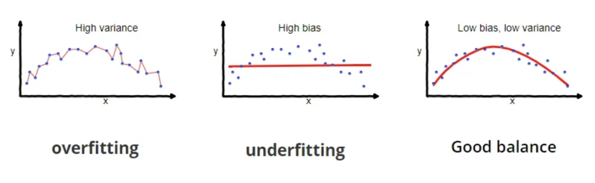

# variance-min-classification
Attempting to directly minimize the bias variance trade off.

# Introduction

Most people who work in Machine Learning are aware of the of the [bias-variance trade off](https://en.wikipedia.org/wiki/Bias%E2%80%93variance_tradeoff). Even if they don't recall the term, show them the picture below and they're immediately familiar with the concept:

I'm going to lay out the obvious, well-known aspects of the bias-variance trade-off, then dive deeper on model variance. IMO, we don't think about this variance deeply enough, or at least that has been my experience in industry. Model variance is misunderstood. The training set for any target prediction problem, is just n samples [(x1, y1), (x2, y2) ... (xn, yn)] drawn from the random variables (x, y). The key point about variance is that a model trained on the first n samples will be different a model trained on the next n samples. However, we never observe this difference, because naturally we train on all the data avaiable. In other words, the model parameters and model predictions, are random variables:

- ![x_y] &nbsp; The input and target, random variables

- ![theta] &nbsp; The model parameters, a random variable

- ![y_hat] &nbsp; The prediction, also a random variable

- ![var] &nbsp; Model variance

The strange thing about machine learning as a field, is that we do not measure, nor attempt to minimize the variance in our models. Bias and variance are both present in any loss function, here is the Mean squared error, decomposed into bias and variance:

- ![mse]

- ![mse_bv]

- ![mse_empirical] - The empirical loss function.

We train a model by minimizing the empirical loss function. The empirical loss function is mischevious, because at first glance it looks like it should have a role in minimizing variance. However minimizing this reduces bias, but continuously increases variance (given the same initial parameterization). The more expressive the model, the more bias can be reduced, but the more variance is increased, as should be obvious to the reader. Variance is not reduced by the empirical loss function, it is reduced primarly with 3 techniques:

1. **Careful Human Modelling - The Old Way** The original way to solve it was to choose a biased model, ideally a biased model based on theory. ne particularly neat example of this approach is [Hook's Law](https://en.wikipedia.org/wiki/Hooke%27s_law). When theory was not possible 

### 1 Careful Human Modelling - The Old Way
The bias-variance trade-off is so central to building models, that since mankind has tried to fit curves, we've had to think about the problem. The original way to solve it was to choose a biased model, ideally a biased model based on theory. One particularly neat example of this approach is [Hook's Law](https://en.wikipedia.org/wiki/Hooke%27s_law) a model architecture based on theory, that accurately predicts the extension of a spring based on weight (Force). Or when theory can't get us all the way there, a human would eyeball the data and conclude "hmmm yes this is parabolic" and choose a parabola as the model.

In both cases, part of the fit is done by the human, and the rest is done by the chosen ML algorithm. Implicit in this first approach is the resignation that the trade-off is fixed, more parameters always means more variance.

### 2 Validation/Test Sets + Graduate Student Descent - The ML Way
While building a model based on theory is nice, it does not scale with dimensionality or complexity. Futhermore, who's to say the model was correct? What ultimately matters is the models empirical accurcacy, when in use (production). By shifting to an approach dictated by theory, to one which only answers to empirical results, we've been freed to discover models which exhibit lower variance **and** lower bias. By iterating on validation set accuracy (as a data scientist), test set accuracy and online experimental results (as individuals teams) and constantly changing paradigms (as a field). We've settled into a variance minimization process called **graduate student descent** which has been by far, the most important variance reduction technique of the 3.

Today we use highly expressive complex models, while managing to keep model variance low. Catboost and Deep Learning are common in production, with a trend towards larger models of the latter. Graduate Student Descent has delivered us to a paradigm allows us to reliably scale model complexity with the amount of data, keeping variance constant, while producing more general (less biased) models. 

We could think of the optimization of ML as 4 layers of optimization, each happening on a longer time horizon:

1. **Training Set** - milliseconds / seconds - The training algorithm updates the model, based on batches of the training set

2. **Validation Set** - minutes / hours / days - The hyper-parameter optimization / data scientist tries different versions of the model or training process, and selects based on validation accuracy.

3. **Test Set and Online tests** - days/ weeks - In an academic context, we have competitions. Teams perform multiple iterations of step 2, and then get a single chance to score a high test set accuracy. This selects for the best approach for the problem at hand. In an industry context, a test set is used to verify worthiness of a release, and an online AB test selects for the best algorithm.

4. **Graduate Student Descent (GSD)** - Weeks / years - This step reflects the optimization over step 3. Novel architectures, new datasets, paradigm shifts. For example, the paper [Attention is all you need](https://arxiv.org/abs/1706.03762). Or OpenAI's decision to build a dataset based on a significant portion of the web.

Until you add regularization techniques to the training process, Variance reduction only happens in steps 2 - 4. When you mention variance reduction, practioners immediately think of regularization techniques. However, the main source of variance reduction has been the GSD process. GSD has produced complex, highly expressive models which exhibit suprisingly low variance. Today's production ML systems are d

### 3 Regularization

Suppose we could take m * n samples {[(x11, y11), (x21, y21) ... (xn1, yn1)], ... [(x1m, y1m), (x2m, y2m) ... (xnm, ynm)]} where we had m training sets, each of sample was of size n. Suppose we then fit a model to predict y from x from each of them. Then with a sufficently large m, and a validation set [(x1, y1), (x2, y2) ... (xn, yn)], we would have a good empirical estimate for model variance. Let:

- ![y_hat_j] &nbsp; The prediction of the jth model on the ith element of the validation set

- ![y_hat_bar] &nbsp; The mean prediction on the ith example of the validation set.

- ![var_empirical] &nbsp; Empirical model variance. 

[x_y]: https://chart.apis.google.com/chart?cht=tx&chl=(x_i%2Cy_i)
[theta]: https://chart.apis.google.com/chart?cht=tx&chl=\theta
[y_hat]: https://chart.apis.google.com/chart?cht=tx&chl=\hat{y}=f(x%2C\theta)
[y_hat_j]: https://chart.apis.google.com/chart?cht=tx&chl=\hat{y}_{ij}=f(x_i%2C\theta_j)
[var]: https://chart.apis.google.com/chart?cht=tx&chl=VAR(\hat{y})=E(\hat{y}-E(\hat{y}))^2
[mse]: https://chart.apis.google.com/chart?cht=tx&chl=L=E(\hat{y}-y)^2
[mse_bv]: https://chart.apis.google.com/chart?cht=tx&chl=L=E(\hat{y}-\bar{y})^2%2BE(\hat{y}-E(\hat{y}))^2
[mse_empirical]: https://chart.apis.google.com/chart?cht=tx&chl=L=\sum_{i=1}^{n}(\hat{y}-y)^2
[var_empirical]: https://chart.apis.google.com/chart?cht=tx&chl=var(\hat{y})=\sum_{i=1}^{n}(\hat{y}_{ij}-\bar{\hat{y}}_i)
[fx]: https://chart.apis.google.com/chart?cht=tx&chl=f_j(x_i)
[y_hat_bar]: https://chart.apis.google.com/chart?cht=tx&chl=\bar{\hat{y}}_i=\frac{1}{m}\sum_{j=1}^{m}\hat{y}_{ij}

